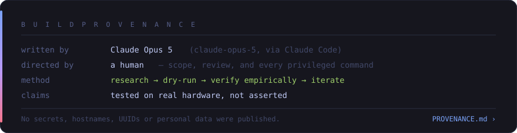

<!--
SPDX-FileCopyrightText: 2026 Godless-1
SPDX-License-Identifier: CC-BY-SA-4.0
-->

<div align="center">

</div>

# Provenance

This page exists so nobody has to guess. If you object to AI-written code, you should be able
to find that out in ten seconds rather than ten commits, and you should get enough detail to
judge the work rather than just the label.

## The short version

**The scripts and documentation in this repository were written by Claude Opus 5
(`claude-opus-5`) running in Claude Code, in a single interactive session on 2026-09-01,
directed and reviewed throughout by a human operator who ran every privileged command
personally.**

No part of this was generated unattended. No part of it was committed unread.

**1.4.3.6 was made differently, and the difference belongs here.** It was written by the same
model running in Claude Code on the web, which holds a GitHub credential of its own. The model
wrote the change, committed it, opened [#1](https://github.com/Godless-1/omarchy-on-cachyos/pull/1)
and [#2](https://github.com/Godless-1/omarchy-on-cachyos/pull/2), merged both on the operator's
instruction, and pushed the `v1.4.3.6` tag - none of which it could do in the original session.
What did not change: it still has no shell on the operator's machine, so every `sudo` command
this project runs remains the operator's to run, and the boot hazards were never within its
reach. What did: the two sentences above describe that first session, not this release.

---

## Division of labour

| Task | Done by |
| --- | --- |
| Set the goal and the framing, revising both as research changed what was possible | Human |
| Ran every privileged command, and returned the output | Human |
| Approved each destructive step | Human |
| **Caught defects in work already called finished** — see below | Human |
| Raised the privacy concern, and named what should not be published | Human |
| Chose the licence, visibility and commit identity; authenticated to GitHub | Human |
| Read Omarchy's packages and scripts | Model |
| Identified the boot hazards | Model |
| Wrote the scripts and documentation | Model |
| Designed the verification tests | Model |
| Reported failures and its own errors | Model |

**Defects the operator caught.** Several faults were spotted by reading the output and the
rendered pages, after the model had checked the same work and called it done:

- Badge text was unreadable. Measurement afterwards showed 1.83:1 against a required 4.5:1 —
  reported from use, before anyone had measured anything.
- GitHub reported two licences where there should have been one, tracing to a prose file
  sitting on a filename the licence detector scans.
- A table shipped with an empty header row — the same accessibility fault fixed earlier in
  this repository and then reintroduced.
- The README claimed the login session was optional. It is registered unconditionally; there
  is no flag to skip it.
- The documentation described the author's hardware in enough incidental detail to identify
  it, which prompted the whole data-minimisation pass below.

None required deep investigation to notice — but none had been noticed.

The split matters for reading the rest of this page: the model wrote the code and did the
research; the operator directed it, ran it, and caught a number of things the model's own
checks had passed over.

The model held no credentials at any point. It could not authenticate, could not enter a
password, and could not run a privileged command — every `sudo` invocation was pasted into a
terminal by the operator, who saw the output and decided whether to continue.

## How it actually went

The session did not begin here. It started as *"add Omarchy under distrobox"*, and the
research killed that idea — Omarchy is a desktop session, not an app bundle. The operator
then redirected to a host install alongside KDE Plasma, and later asked about a VM, which the
research also argued against once it became clear Hyprland runs nested in a window with no
guest and therefore no file-sharing problem.

Roughly the order of work:

1. **Research.** Read the actual `omarchy` and `omarchy-settings` packages — file lists,
   dependency metadata, install scripts, hook drop-ins — rather than relying on documentation
   or recollection.
2. **Reconnaissance.** Inspect the target system's bootloader, initramfs hooks, encryption
   scheme, display manager, GPU and repositories before proposing anything.
3. **Hazard analysis.** Three findings, each traced to the specific file that causes it.
4. **Empirical verification.** The dangerous claim — that Omarchy's hook drop-in breaks a
   LUKS root — was *demonstrated* by evaluating the hook list with and without the file, not
   argued from first principles.
5. **Dry runs.** Every script gained a `--dry-run` and was exercised before touching anything.
6. **Iteration on real failures.** Two pacman transactions failed. Both were diagnosed from
   the actual error, fixed, and re-run.
7. **Verification tooling.** A separate script exists purely to prove the machine still boots.

## Mistakes made, and corrected

Listed because a provenance page that claims a clean run would be worth less than nothing.

| Mistake | How it surfaced | Fix |
|---|---|---|
| Claimed `omarchy-update` overwrites `pacman.conf` | Reading the script; it does not — only `omarchy-refresh-pacman` does | Corrected in the docs; the real risk (migrations) documented instead |
| Nested window used a fixed default size | Larger than the logical desktop on a scaled display | Queries KWin for the real work area |
| Auto-size picked a **disabled** output | A disabled output still reports geometry | Filters to enabled outputs |
| `--bare` disabled Omarchy's autostart, silently killing `SUPER+SPACE` | The menu is a shell plugin and had no backend | `--bare` now starts the shell explicitly |
| Config seeding read only one of the two packages shipping `/etc/skel` | 96 migration markers never landed | Seeds from both |
| A conflict scan reported 89 conflicts | 88 were `Replaces`/`Provides` pairs pacman handles | Rewritten to find genuine conflicts; found exactly one |
| `kscreen-doctor` parser returned empty | ANSI colour codes | Strips escapes first |
| Guard block was written once and skipped on re-run | Would have dropped a later-added guard | Rewrites the block every run |
| `verify-reboot-safety.sh` searched `/boot` at depth 2 for `initramfs*.img` | The kernel-install layout is `/boot/<token>/<kernel>/initramfs` — no extension, one level deeper — so it found nothing and still reported PASS on exit code alone | Searches both layouts |
| The same script then grepped `lsinitcpio -a` for a `Hooks` line | No such line exists for a systemd initramfs; it reported four confident failures on an intact machine | Checks for `systemd-cryptsetup` and `cryptsetup.target` instead, per init style |
| It judged every image on disk, including orphaned entry directories | Stale images from an old machine-id will always lack what the live ones have | Scoped to the active entry token; orphans reported, not judged |
| `--rebuild`'s post-rebuild check kept the broken `lsinitcpio -a` method | Section 3 had been fixed and section 8 left behind; it would have falsely reported DO NOT REBOOT after a good rebuild | Both call one shared `check_image()` |
| `omarchy-window` reported "KDE shortcuts yield to Omarchy" having installed nothing | Missing `qdbus` set a variable nothing read, and returned success | Returns failure, and says what to do |
| The verifier printed "Safe to reboot" when checks had been skipped | A warning usually means a check could not run at all | Separates "no failures" from "everything ran" |
| A filed upstream bug report had the wrong root cause | `fakeroot` fakes uid 0, so it triggered a libalpm path the real program never takes; `strace` showed zero such syscalls | Retracted and closed the same day, with the reasoning error explained |
| Advised restoring `/etc/os-release` by symlinking it | CachyOS keeps its identity in an unowned file edited in place, so that produced plain Arch branding | Uses the distribution's own branding script |
| 64 makepkg build artefacts were committed | `git add -A` after building in the repo; CI then rebuilt a stale extracted tree instead of the tagged tarball | `.gitignore` covers them, with a comment on why it matters |
| `grep -c . \|\| echo 0` broke the diagnostics' arithmetic | `grep -c` prints 0 *and* exits 1, so the fallback appended a second 0 | Uses `\|\| true` and a default |
| Fixing the launcher environment did not move browser windows | Two more escapes: `omarchy-launch-browser` wraps the launch in `systemd-run --user`, which builds the unit with the user manager's environment before the `uwsm-app` shim is reached; and a browser already running on the host is single-instance, so a second invocation only signals the first, whose window was never created in the nested session | A `systemd-run` shim that passes timers straight through, and a separate browser profile in the project's own data directory |
| CI ran the test suites on Ubuntu, which has no `vercmp` | Every "an update **is** available" assertion failed there, and every "stays silent" assertion passed for the wrong reason. A suite that cannot tell those apart is worse than none | The job runs in `archlinux:base-devel`, the tooling this actually targets |
| A release was reported green when its CI had not finished | The check polled `gh run list --limit 1` without matching the head SHA, so it read the *previous* commit's success | Poll for the run whose `headSha` is this commit, and wait for that one |
| The post-install greeting kept going stale | It forgot `omarchy-window-shortcuts` for two releases, then forgot `omarchy-oc-update` immediately after that was fixed. Nothing breaks, so nobody notices | `test/test-packaging.sh` makes the lists check each other; it found a missing `ooc` alias on its first run |
| The watchdog then died on the line that was supposed to end the session | `real=$(hyprctl … \| python3 …)` is an assignment taking the pipeline's status, and under `set -e` with `pipefail` a transient hyprctl failure killed the watchdog. Then `hyprctl dispatch exit` returned 7 on a Lua-dispatcher Hyprland (`hl.dsp.exit()` is the spelling) and killed it again, before the signal fallback it already had | Every step guarded; escalates dispatch, then SIGTERM, then SIGKILL |
| A watchdog test asserted only "did not fire" | That is equally true of a watchdog that has crashed, so the suite passed while the thing was dying on the job | It now asserts the watchdog is still **running** after a failure, and still fires afterwards |
| The watchdog meant to fix that never matched its own instance, and its tests passed anyway | `hyprland.lock` holds the pid and the display on **two lines**, so `cut -d' ' -f1` returned both joined and never equalled a pid. The test fixture wrote the lock space-separated on one line — the same misreading the code made — so the suite confirmed the assumption instead of the behaviour | Reads the first line only; the fixture writes the real bytes and fails against the old code |
| Closing the nested window did not end the session | Hyprland keeps running when its last output goes away, on a synthetic `FALLBACK` monitor, and `--detach` left nothing to reap it. Every launch leaked an invisible compositor holding borrowed keys; seven were found running at once, the oldest thirteen hours old | A watchdog that finds its own instance via `hyprland.lock` and exits when the real output goes |
| The desktop entry pinned whichever copy ran `--install-desktop` | The launcher kept starting a working checkout, so upgrading the package changed nothing about what actually ran - which is why a session started after an upgrade was still running the old code | Uses the command on `PATH` when it resolves to the same script, so the entry follows upgrades |
| Every release tag from v1.1.0 to v1.4.0 was unbuildable | A tarball checksum cannot live inside the tarball it describes: the hash was taken after tagging and committed after, so the PKGBUILD *inside* each tag carried one that could never match. Cloning `main` worked, which is what the instructions said, so it survived four releases until the install instructions were run instead of assumed | Sourced from the git tag, which has no such loop |
| Closing one nested window took the borrowed keys back from every other open one | The borrow was a single on/off flag, so the first window to exit restored everything while others were still using it. Found by inspection after the user was running seven sessions at once | Reference counted by pid and process start time; the keys go back when the last holder lets go |
| The documented keybinding table listed keys that do not exist | `Super+Q` was given as Terminal and `Super+Escape` as exit; Omarchy 4 uses `Super+Return`, `Super+Escape` is the system menu, and `Super+Q` is unbound. Written from assumption, never checked against `bindings/*.lua` | Table corrected against the source, and it now points at `Super+K` as the authority |
| Apps launched from inside the nested window opened on the host desktop | Omarchy launches through `uwsm-app`, which delegates to a systemd *user* unit carrying the host session's environment — so every launcher handed its app `WAYLAND_DISPLAY=wayland-0` and no Hyprland signature. Reported as "I can't open Claude in Omarchy"; the window was opening in Plasma | A `uwsm-app` shim first on the nested session's `PATH`, running commands in place |
| `CLAUDE_CONFIG_DIR` was set from the shell rc files | Omarchy's launchers run the binary directly through `foo -e`, which never reads a shell rc, so the fix missed the exact path that needed it | Moved to a single desktop-entry override, leaving the terminal on the default directory that every launch path already finds |
| A second `trap ... EXIT` silently replaced the first | The temporary nested-config directory leaked on every run of `omarchy-window` | One `cleanup()`, armed before the first early exit |
| Restoring `/etc/os-release` orphaned a bootloader entry, and one menu entry then failed to boot | `limine-entry-tool` titles its top-level OS entry from `NAME`/`PRETTY_NAME` and keys on that title, so a changed distribution name makes it write a *new* entry and abandon the old. The abandoned one kept the verification hashes it had that day and errored out, while the working entry carried the wrong distro's name. Traced back to the `ln -sf ../usr/lib/os-release` advice below | The identity script now tells you to run `limine-update`, and `verify-reboot-safety.sh` fails when more than one top-level entry claims this machine |
| The key handover called `blockGlobalShortcuts`, which is all-or-nothing | It also silenced <kbd>Super</kbd> on its own and <kbd>Alt</kbd>+<kbd>Tab</kbd> — neither of which Omarchy uses, both of which the user still wanted from Plasma. Reported from use, not found by review | Clears only Meta-modified combinations, which leaves both untouched by construction |
| The installer treated every `pacman` failure as fatal | A second machine had 22 of 23 packages down when a CDN reset one stream and a mirror answered 404 for a file the local database still listed. Nothing was wrong with the machine and nothing needed deciding, but the transaction rolled back and the only way on was a human noticing and re-running the script | Download failures are retried, a 404 forces a `-Syy` first, a corrupted download is discarded rather than re-validated, and `--disable-download-timeout` keeps a slow mirror from counting as a dead one |

The pattern worth noting: most were caught by *running the thing*, which is why the dry-run
and verification steps exist at all.

Three of these deserve emphasis, because they are the worst kind. The verification script —
the one whose entire job is to be trustworthy about whether a machine still boots — was wrong
twice, and both times it failed **loudly and confidently** rather than quietly. It reported
`PASS` while silently skipping its most important check, and later reported four failures on a
system that was completely intact. A check that cannot distinguish *absent* from *I looked in
the wrong place* is worse than no check at all, because it spends your trust at exactly the
moment you need it. It now says so explicitly when it cannot inspect something.

## What was verified rather than assumed

- The hook-list breakage, by evaluating `HOOKS` both ways
- `pacman.conf` edits, by round-tripping a copy and diffing against the original
- The KWin work area, by querying KWin instead of computing from panel settings
- The initramfs, by listing it with `lsinitcpio -l` and confirming `systemd-cryptsetup`
  and `cryptsetup.target` are present (`lsinitcpio -a` was the wrong tool — see above)
- Package resolution, by full dependency resolution before installing
- Every internal documentation link, mechanically
- The absence of personal data, by scanning every file

## What was NOT tested

Stated plainly, because "written carefully" is not the same as "exercised", and the rest of
this page would be worth less if this section were missing.

| Path | Status |
| --- | --- |
| The ten diagnostics | **Tested.** `test/test-diagnose.sh` injects each fault into a fake system tree and asserts it is caught; a healthy tree must report nothing. Runs in CI |
| Every script, statically | **Linted.** `shellcheck` at `-S style`, pinned to one version, in CI |
| The package | **Built in CI** in an Arch container, asserting all eight commands reach `/usr/bin` |
| `install-omarchy-on-cachyos.sh` | **Exercised.** Dry-run plus real runs, including two failed pacman transactions that were diagnosed and fixed |
| The pacman retry path in that script | **Tested, not exercised.** `test/test-pacman-retry.sh` drives it against a scripted pacman: retry, a forced `-Syy` after a 404, a corrupted cache file discarded by name, an immediate stop on a conflict. It has never met a mirror actually failing - the failure that prompted it was observed, the recovery was not |
| The sudo keepalive in that script | **Never exercised.** Written, linted, syntax-checked; no run has yet outlived a sudo timestamp |
| `verify-reboot-safety.sh` | **Exercised heavily.** Four runs; three of its own bugs found that way |
| `omarchy-window --bare` | **Exercised.** Launched nested, sized to the work area, keybindings confirmed working |
| `block-omarchy-updates.sh` (install path) | **Exercised.** All four binaries guarded, `NoExtract` present, originals stashed |
| `preserve-cachyos-identity.sh --apply` | **Exercised.** Branding restored and confirmed with fastfetch |
| `clean-stale-boot-entries.sh --archive` | **Exercised once**, on one machine |
| `uninstall-omarchy-on-cachyos.sh` | **Never run.** Written, linted, syntax-checked only |
| `block-omarchy-updates.sh --undo` | **Never run** |
| `OMARCHY_ALLOW_DANGEROUS=1` override | **Never run** |
| `clean-stale-boot-entries.sh --delete` | **Never run** |
| The "bootloader still references it" refusal | **Never triggered** — the one run had no references |
| `verify-reboot-safety.sh` on a busybox initramfs | **Never run.** That branch is reasoned, not observed |
| Any non-CachyOS base, or a non-KDE desktop | **Never run** |

The untested paths are mostly the reversal ones, which is the uncomfortable half: the code you
reach for when something has already gone wrong is the code with the least evidence behind it.
They are short and readable — read them before you rely on them, and keep the backups the
installer made.

One bug in exactly this category was found only by reading the output of a successful run: the
vault of stashed originals contained **symlinks that resolved back to the guard**, because
`/usr/share/omarchy/bin/omarchy-*` are symlinks into `/usr/bin` and `cp -a` preserved them as
such. The install path worked perfectly; `--undo` would have restored a guard over a guard.
Fixed with `cp -aL`, a repair pass for vaults written by earlier versions, and a refusal in
the guard to exec anything that is itself a guard.

## Privacy

The operator's machine is not described in this repository. Before publication every file was
scanned for the username, hostname, LUKS UUID, monitor UUIDs, email address, IP addresses and
hardware model. All are absent.

The scripts contain **no hardcoded machine values**. Geometry, work area, output names, UUIDs,
package lists and paths are all discovered at runtime, which is both why they are portable and
why they leak nothing. Commits are authored under a GitHub `noreply` address by choice.

The one identifier present is the GitHub account that owns the repository, which is
unavoidable for a public repository and was chosen deliberately.

### Data minimisation, not just secret-scrubbing

Removing secrets is the easy half. The harder one is the **mosaic effect**: individually
mundane facts that combine into a description of one machine. A form factor, a GPU vendor
pair, an exact resolution and scale factor, a partition size, a greeter, a filesystem — none
is sensitive alone, and together they describe a single computer.

So incidental specifics were generalised wherever they were not load-bearing:

| Detail | Replaced with | Why |
| --- | --- | --- |
| A named form factor | The neutral term for the component | The form factor was irrelevant to the bug being described |
| An exact resolution and scale factor | The scaling rule, plus a command to read your own | The rule is what transfers; the numbers described one machine |
| A reclaimed byte count and a partition size | A qualitative statement | Storage sizes describe hardware |
| Truncated machine-ids | `<active-token>`, `<stale-token>` | A 32-bit prefix of a real identifier is still an identifier |
| A named greeter and specific GPU vendors | Their general category | Enough to say what was exercised, not which machine |

Note that this table names *categories* rather than quoting the original strings. Documenting
a scrub by reprinting what was scrubbed would undo it.

What stays is what the project is *about* — a LUKS root on btrfs with limine and snapper —
because that is the subject matter, not an incidental detail about the author's hardware.

Documentation examples now use placeholders and teach the rule rather than reprinting one
machine's output. That is better documentation independently of the privacy benefit: a reader
should be running the command on their own system, not comparing against someone else's.

## Auditing this yourself

Nothing here asks for trust:

```bash
# Read every line - it is 5 scripts and none are long
wc -l *.sh omarchy-window

# Watch what it would do, touching nothing, without sudo
./install-omarchy-on-cachyos.sh --dry-run

# Check the licensing metadata
pipx run reuse lint

# Verify the hazard claim on your own machine
sudo bash -c 'HOOKS=(); . /etc/mkinitcpio.conf
  for f in /etc/mkinitcpio.conf.d/*.conf; do [ -e "$f" ] && . "$f"; done
  echo "${HOOKS[*]}"'
```

Every hazard in [`docs/hazards.md`](docs/hazards.md) names the exact file that causes it, so
you can read Omarchy's source and confirm the claim independently. That is the intended
standard of evidence — not the identity of whoever typed it.

## If you would rather not use AI-written code

That is a legitimate position and this page exists to let you act on it without wasting your
time. The findings are reproducible from the commands above, and the licence is
[copyleft](LICENSING.md) — you are free to reimplement any of it, and to do so knowing exactly
what the original was and was not.
