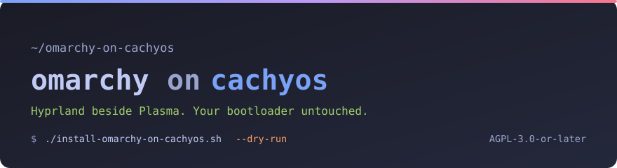

<!--
SPDX-FileCopyrightText: 2026 Godless-1
SPDX-License-Identifier: CC-BY-SA-4.0
-->

<div align="center">



</div>

# omarchy-on-cachyos

**Two ways to run the full [Omarchy](https://omarchy.org) desktop on CachyOS or Arch: as a
login session beside the one you already use, and in a window inside it. One install sets up
both — without letting Omarchy near your bootloader, your initramfs, or your repos.**

<a href="install-omarchy-on-cachyos.sh"></a>
<a href="https://omarchy.org"></a>
<a href="https://cachyos.org"></a>
<a href="LICENSES/AGPL-3.0-or-later.txt"></a>
<a href="LICENSES/CC-BY-SA-4.0.txt"></a>
<a href="PROVENANCE.md"></a>

---

## Start here

*What this is, in thirty seconds.*

[Omarchy](https://omarchy.org) is a complete Hyprland desktop, shipped as pacman packages.
Those packages assume they own the machine: installed as-is on a system that already has a
desktop, they rewrite your initramfs, your bootloader entries and your package repositories.
On a LUKS-encrypted root that means **your root filesystem stops unlocking**.

This repository installs Omarchy with those behaviours fenced off, and gives you two ways to
run it — in a window, or as a login session — plus a script that proves your machine still boots.

```bash
git clone https://github.com/Godless-1/omarchy-on-cachyos.git
cd omarchy-on-cachyos
makepkg -si          # optional: puts the commands on your PATH
omarchy-on-cachyos   # or ./omarchy-on-cachyos without installing
```

That opens a menu showing what is and isn't set up on your system, and runs everything from
one place. Every entry is also a standalone script if you prefer them directly.

| Property | What to expect |
| --- | --- |
| Time | ~10 minutes plus download |
| Download | ~750 MB (`--minimal` is much less) |
| Touches your bootloader | **No** — guarded |
| Touches your initramfs hooks | **No** — guarded, and verified afterwards |
| Touches your repositories | Adds one, ordered **last**, so it never overrides yours |
| Touches your distro's branding | **No** — restored and pinned |
| Your existing desktop | Untouched, and still selectable at login |
| Reversible | Yes — uninstaller, config backups, and a bootable snapshot |
| Needs a reboot | No — a logout for the session, nothing at all for the window |

> [!CAUTION]
> On a LUKS-encrypted system, installing Omarchy's packages **unguarded** can leave you unable
> to unlock your root filesystem. Read [The three hazards](#the-three-hazards) before running
> anything — including if you decide not to use these scripts.

---

<div align="center">

<a href="PROVENANCE.md"></a>

</div>

> **Build provenance.** The scripts and documentation here were **written by Claude Opus 5
> (`claude-opus-5`) in Claude Code**, on 2026-09-01, directed and reviewed throughout by a
> human operator who ran every privileged command personally. Nothing was generated
> unattended or committed unread. [**PROVENANCE.md**](PROVENANCE.md) gives the full account,
> including [the mistakes made and corrected](PROVENANCE.md#mistakes-made-and-corrected)
> along the way, and [how to verify every claim yourself](PROVENANCE.md#auditing-this-yourself).

---

## Two ways to run it

*Both come from one install. Neither is a fallback for the other.*

### As a login session

The installer registers Omarchy in your greeter's session list, always — there is no flag to
skip it and nothing to opt into. Log out and **Omarchy (Hyprland uwsm)** is there beside your
existing desktop; pick either, any time. It runs at native resolution on your real hardware,
which is the way to judge how Omarchy actually looks and feels.

Your existing session is untouched and stays selectable, so switching back is a logout, not
an uninstall.

### In a window on your current session

Hyprland's Aquamarine backend runs nested when `WAYLAND_DISPLAY` is set, so the whole Omarchy
desktop can run **in a window on the session you are already using** — same machine, same
filesystem, nothing to share between them:

```bash
./omarchy-window --bare
```

It asks KWin for your real work area (screen minus panels), sizes the nested output to match
exactly, and pins it there with no titlebar. `--install-desktop` adds a launcher entry with
an Omarchy icon so it starts from your application menu with no terminal behind it.

While that window is focused, your desktop's global shortcuts step aside so Omarchy's
keybindings work — and come straight back when you focus something else.

`--bare` skips Omarchy's `systemctl --user import-environment`, which would otherwise
overwrite `WAYLAND_DISPLAY` in your **host** session, while still starting the Omarchy shell
so the menu and bar work.

| Key | Action |
| --- | --- |
| <kbd>Super</kbd>+<kbd>Space</kbd> | Omarchy menu |
| <kbd>Super</kbd>+<kbd>K</kbd> | Omarchy's own keybinding cheatsheet |
| <kbd>Super</kbd>+<kbd>Q</kbd> | Terminal |
| <kbd>Super</kbd>+<kbd>Escape</kbd> | Exit the nested session |

---

## The three hazards

*What Omarchy's packages do to a host that already has its own configuration. Worth reading
even if you install Omarchy by hand instead.*

### 1. It replaces your initramfs hook list

`/etc/mkinitcpio.conf.d/omarchy_hooks.conf` contains a **bare assignment**:

```bash
HOOKS=(base udev plymouth keyboard autodetect microcode modconf kms keymap \
       consolefont block encrypt filesystems fsck btrfs-overlayfs)
```

It has no numeric prefix, so it sorts *after* drop-ins like `10-chwd.conf` and
`10-limine-snapper-sync.conf` and **replaces** them rather than extending them.

On a systemd-initramfs system this swaps `sd-encrypt` → `encrypt` and
`sd-btrfs-overlayfs` → `btrfs-overlayfs`. The busybox `encrypt` hook **does not parse
`rd.luks.uuid=`**, which is the syntax a systemd initramfs puts on your kernel cmdline.

| Component | Before | After |
| --- | --- | --- |
| init system | `systemd` | `udev` |
| LUKS unlock | `sd-encrypt` — works | `encrypt` — **cannot parse `rd.luks.uuid=`** |
| Snapshot boot | `sd-btrfs-overlayfs` — works | `btrfs-overlayfs` — **broken** |

Root does not unlock, and booting a snapshot breaks in the same stroke. Verified empirically,
not theorised — the method is in [docs/hazards.md](docs/hazards.md).

### 2. It hijacks your boot entries

`/etc/limine-entry-tool.d/omarchy-{defaults,uki}.conf` sets `ENABLE_UKI=yes`,
`CUSTOM_UKI_NAME="omarchy"`, renames your OS entry to `Omarchy`, appends kernel parameters,
and rewrites `BOOT_ORDER`.

### 3. Two commands delete your repositories

`omarchy-refresh-pacman` overwrites `/etc/pacman.conf` and your mirrorlist with Omarchy's,
then runs `pacman -Syyuu`. On CachyOS that removes `cachyos-v3`, `cachyos-core-v3`,
`cachyos-extra-v3` and anything else you added, and force-downgrades every optimised package.
`omarchy-channel-set` and `omarchy-reinstall-pkgs` both call it.

`omarchy-update` is a different problem: it runs `omarchy-migrate`, and a package-based
install never marks the shipped migrations complete, so all of them are pending — including
one that disables `sshd`. See [docs/migrations.md](docs/migrations.md).

---

## How it protects you

*The mechanisms, and their one real limitation.*

| Mechanism | Protects against |
| --- | --- |
| `NoExtract` in `pacman.conf` | Hazards 1 and 2, **durably** — survives package updates |
| Hard gate after install | Aborts with *DO NOT REBOOT* if `sd-encrypt` has vanished |
| Binary guards plus `NoExtract` | Hazard 3, from every shell, both sessions, and the Omarchy menu |
| A `PostTransaction` hook of our own | The `etc-overrides` script, which `NoExtract` cannot reach |
| Snapper snapshot and backups | Rollback if anything else surprises you |

`NoExtract` is the key idea: pacman never extracts those paths, so the protection **survives
`pacman -Syu`** instead of being undone by the next update.

> [!WARNING]
> `NoExtract` blocks package *extraction*. It cannot block a package's **post-install
> script**, and `omarchy-settings` has one that copies `etc-overrides/` into `/etc` —
> replacing your `os-release`, Plymouth theme and fastfetch config. That is what
> [`preserve-cachyos-identity.sh`](preserve-cachyos-identity.sh) is for: it restores them and
> installs a hook that restores them again after every Omarchy update.

---

## Install

*The full sequence, if you would rather not use the menu.*

> [!IMPORTANT]
> Read [The three hazards](#the-three-hazards) first. Then dry-run. Then install.

```bash
./install-omarchy-on-cachyos.sh --dry-run   # changes nothing, needs no sudo
./install-omarchy-on-cachyos.sh             # the real thing
./block-omarchy-updates.sh                  # fence off the destructive commands
./preserve-cachyos-identity.sh --apply      # keep your distro's name and theming
./verify-reboot-safety.sh                   # prove the machine still boots
```

Then log out and pick **Omarchy (Hyprland uwsm)**, or run `./omarchy-window --bare` to stay
where you are.

### What the installer actually does

1. Backs up `pacman.conf`, `mkinitcpio.conf`, drop-ins and your package list
2. Takes a snapper snapshot, bootable from your boot menu
3. Writes the `NoExtract` guards **before** installing anything
4. Installs `omarchy-keyring` over HTTPS and **verifies fingerprint
   `40DFB630FF42BCFFB047046CF0134EE680CAC571`** — it never lowers `SigLevel` to `TrustAll`
5. Adds `[omarchy]` **last**, so it can never override your distro's packages
6. Installs `omarchy` with `--assume-installed sddm` (keeps your display manager)
7. **Hard gate**: recomputes effective `HOOKS`; aborts if `sd-encrypt` is gone
8. Installs the Omarchy userspace, skipping packages that conflict with your system
9. Symlinks the session file where your greeter will find it
10. Seeds `~/.config` **copy-if-absent** — your files always win

---

## Commands

*Each runs on its own; the menu is only a front end.*

Installed with `makepkg -si`, everything is on `PATH` under a short name. Run from a checkout
instead and the file names in the second column are what you call.

| Command | Script | Purpose |
| --- | --- | --- |
| `omarchy-on-cachyos` | [`omarchy-on-cachyos`](omarchy-on-cachyos) | **Menu fronting everything below.** `status` prints state and exits |
| `omarchy-window` | [`omarchy-window`](omarchy-window) | Omarchy in a window. `--bare`, `-s WxH`, `--detach`, `--install-desktop` |
| `omarchy-oc-install` | [`install-omarchy-on-cachyos.sh`](install-omarchy-on-cachyos.sh) | Guarded install. `--dry-run`, `--minimal` |
| `omarchy-oc-block-updates` | [`block-omarchy-updates.sh`](block-omarchy-updates.sh) | Fence off the destructive commands. `--undo`, `--status` |
| `omarchy-oc-preserve-identity` | [`preserve-cachyos-identity.sh`](preserve-cachyos-identity.sh) | Keep your distro's name, Plymouth theme and fastfetch. `--apply`, `--undo` |
| `omarchy-oc-verify-boot` | [`verify-reboot-safety.sh`](verify-reboot-safety.sh) | Prove you can still boot. `--rebuild` |
| `omarchy-oc-clean-boot` | [`clean-stale-boot-entries.sh`](clean-stale-boot-entries.sh) | Reclaim orphaned `/boot/<token>/` dirs. `--archive`, `--delete` |
| `omarchy-oc-uninstall` | [`uninstall-omarchy-on-cachyos.sh`](uninstall-omarchy-on-cachyos.sh) | Reverse the install. `--keep-apps` |

An already-open shell caches command lookups: `hash -r` in bash, `rehash` in zsh. fish picks
them up on its own.

## Documentation

*Longer form, one topic each.*

- **[The hazards, in full](docs/hazards.md)** — what each one does and why the guard works
- **[How it works](docs/how-it-works.md)** — packaging, `NoExtract`, `etc-overrides`
- **[The nested window](docs/nested-window.md)** — sizing, KWin rules, `--bare`
- **[Migrations](docs/migrations.md)** — the 96 markers and why they matter
- **[Troubleshooting](docs/troubleshooting.md)** — real conflicts and their fixes
- **[Licensing](LICENSING.md)** — why AGPL for code and CC BY-SA for prose
- **[Provenance](PROVENANCE.md)** — how this was built, the mistakes made doing it, and
  [which code paths have never been run](PROVENANCE.md#what-was-not-tested)

---

## Requirements

*What this expects of your system.*

Arch or an Arch derivative with a working desktop session, `pacman`, `curl`, `bsdtar`,
`python3`, and internet access. The nested window also needs a Wayland session;
exact work-area fitting is KDE-specific (`kscreen-doctor`, KWin scripting) and degrades
gracefully elsewhere.

Developed against **Omarchy 4.0.2** on **CachyOS**, with a LUKS root on btrfs, limine and
snapper, a greetd-based greeter, and more than one GPU. Other bases should work; the guards
are written defensively and the verifier will tell you the truth either way.

## Accessibility and theming

The two banners are decoration. Everything they say is also written as ordinary text beside
them, so nothing is lost if images are off, and each carries descriptive `alt` text rather
than a filename.

Colour contrast was **measured, not eyeballed** — every foreground meets WCAG 2.1 AA against
its background. Two colours from the original palette failed (2.9:1 and 2.0:1) and were
replaced. No meaning is carried by colour alone, tables have real headers, and no link points
at a placeholder.

**Badges.** The badges are hand-made SVGs in this repository, not shields.io images. Shields.io
hardcodes white text (`fill="#fff"`) on both halves of a badge, and the Tokyo Night accents are
light tones meant for dark backgrounds — white on `#9ece6a` measures **1.83:1**, which is close
to invisible. Inverting the relationship (accent text on a dark plate) puts every badge between
**5.5:1 and 9.0:1**. It also means the header makes no external requests, so nothing about who
reads this page is sent to a third party.

**Theming.** The banners are deliberately dark in both GitHub themes rather than swapping with
`prefers-color-scheme`. That is a considered choice, not an oversight: a theme-swapped light
variant is exactly what an extension like **Dark Reader** would invert, producing a glaring
card on an otherwise dark page. A card that is already dark is left alone. Both have a subtle
border so they read as intentional on GitHub's light theme too. Everything else — alerts,
tables, `<kbd>` keys, code blocks — uses GitHub's own theme-aware styling.

If something reads badly in a screen reader, or looks wrong in a theme or with a contrast
extension, that is a bug. Please open an issue.

---

<div align="center">

**Copyleft.** Scripts are [AGPL-3.0-or-later](LICENSES/AGPL-3.0-or-later.txt); prose and
artwork are [CC BY-SA 4.0](LICENSES/CC-BY-SA-4.0.txt). Improve it and your users keep every
freedom you were given. No CLA, no assignment, no relicensing escape hatch. — [Licensing](LICENSING.md)

**Unofficial.** Not affiliated with, endorsed by, or supported by Omarchy, Basecamp, DHH,
or CachyOS. Omarchy is [MIT-licensed](https://github.com/basecamp/omarchy) and excellent —
this repo just helps it share a machine.

<sub>No warranty. It edits <code>pacman.conf</code> and replaces two binaries. Read the scripts.</sub>

</div>
